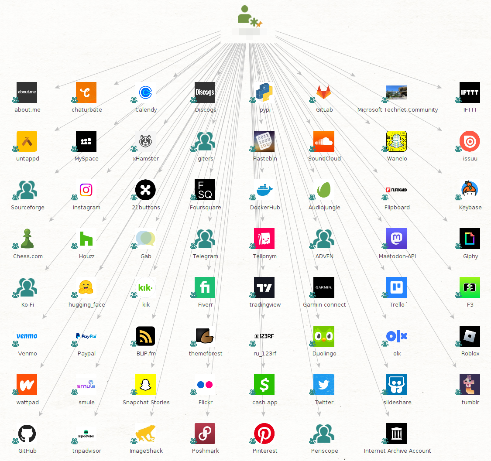
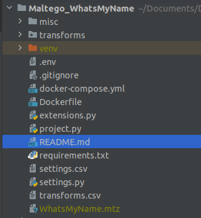

# Maltego WhatsMyName Transforms

The Maltego WhatsMyName Transforms are based on the amazing [whatsmyname.app](https://whatsmyname.app/) tool 
created by [Micah "WebBreacher" Hoffman](https://webbreacher.com/) that allows you to enumerate usernames across many websites.

## The Transforms

There are currently 5 Transforms available

- **To Alias [WhatsMyName]**: Extract the username portion (Anything before the @) of en Email Entity.
- **To Sites [WhatsMyName]**: This is the main Transform, it takes an Alias Entity and checks a list of 500+ websites 
for matches on the username. A new OnlineGroup Entity is created for each match.
- **To Category [WhatsMyName]**: Get the category of the OnlineGroup Entities i.e., Social Media, Games, Finance, etc.
- **To Profile URL [WhatsMyName]**: Extract the URL associated with the identified profiles, this Transforms provides 
additional information that can be used to confirm whether the account belongs to the POI.
- **To Platform [WhatsMyName]**: You can use this to extract the Website associated with each platform, this can be used 
to obtain additional information through the Maltego Standard Transforms.

## Installation

Install the required libraries by running

`pip install -r requirements.txt`

A Maltego configuration file **WhatsMyName.mtz** can be automatically generated to easily import the Transforms and 
Transform Set into your client.

1. Open your Terminal and go to your project's main directory.
2. Run `python3 project.py list`

That's all you need, you should now have the new configuration file inside your project.

Simply import the file into your client by going to Import | Export > Import Config > Select mtz file.

Your new configuration file includes a Transform set called "WhatsMyName" which will arrange your new Transforms into a 
submenu, making them easier to find and use.

If you are a more advanced user and want to manually add the Transforms to your client, you can follow this 
[instructions](https://docs.maltego.com/support/solutions/articles/15000017605-local-transforms-example-#adding-the-transform-to-maltego-0-6)

## Disclaimer

This tool is provided for educational purposes only. It is designed to promote understanding and learning of OSINT 
(Open Source Intelligence) techniques and methodologies. **It should not be used for illegal activities, and the author 
does not support or condone illegal or unethical actions.**

The author is not responsible or liable for any misuse of this tool, including any damage, consequences, or violations 
of laws or agreements resulting from the inappropriate use of this tool. **By using this tool, you agree to this 
disclaimer and assume full responsibility for your actions.**

### OPSEC (Operational Security)

Please also be aware that the requests generated to each website will be local requests, I highly recommend using a VPN 
to protect your privacy and security.

Happy OSINTing!

